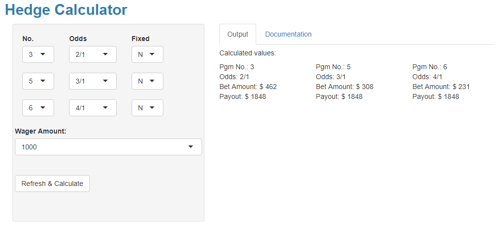
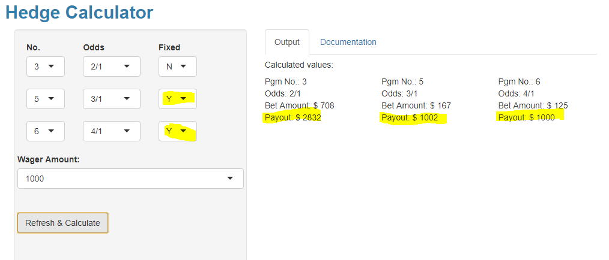

```{r setup, include=FALSE}
knitr::opts_chunk$set(echo = TRUE)
library(tidyverse)
library(shinydashboard)
library(shiny)
library(tidyverse)
library(dbplyr)
library(DBI)
library(gt)
library(RMariaDB)
library(skimr)
```


</br>
<style>
div.blue { background-color:rgba(49, 126, 172, 0.1); border-radius: 5px; padding: 20px;}
</style>
<div class = "blue">
## Midterm Objective

#### My proposal is to complete an analysis to determine the extent that hedging, and derivatives can be utilized to improve horse racing wager returns.  The proposed analysis will seek to compare wager returns obtained from straight win bets to returns obtained from a variety of hedged and derivative win bet strategies. 

#### Mid-term deliverable include:

#### 1.	Literature Review
#### 2.	Data Gathering
#### 3.	Definition of hedging and derivative wagering strategies
#### 4.	Develop of function(s) / algorithm to employ the proposed strategies 
#### 5.	Prototype of hedging function(s) with Shiny App
</div>

</br>
<style>
div.blue { background-color:rgba(49, 126, 172, 0.1); border-radius: 5px; padding: 20px;}
</style>
<div class = "blue">
## Literature Review

The Literature Review is broken down into two primary groups:

### Simple Win-bet Strategies employed in papers aimed a picking winning horses.  These strategies typically called for the identification of value - A situation where the projected payoff was disproportionately higher to the horses true chances of winning.  

In __1981 Henry__ described the outcome of races as being the consequence of a stochastic ordering of the permutations which define the outcome of a race. Henry also developed formulas. Henry’s formulas were better at predicting win, place and show runners, but also were significantly more challenging from a mathematical perspective.   

In __1986, Bolton and Chapman__ performed a study on 200 races from five U.S. tracks.  The study employed 10 basic handicapping variables yielded returns of approximately 3.3% utilizing a simple win-bet wagering strategy.  

In __1994, Benter__ published Computer Based Horse Race Handicapping and Wagering Systems: A Report.  This study utilized Hong Kong racing data and employed at least 20 sophisticated independent handicapping variables. Benter clearly demonstrated that a computerized handicapping system can beat the races. The author stated that at least at sometimes, at some tracks, a statistically derived fundamental handicapping model can achieve a significant positive expectation.  It should be noted that prior to writing his paper, Mr. Benter had spent the previous five years in Hong Kong developing a handicapping team and model. In 2019, Mr. Benter was featured in the Bloomberg article, The Gambler Who Cracked the Horse Race Code – A Billion Dollars Later He Tells His Story. 

In __2008, Chapman__, published Still Searching For Positive Returns At The Track: Empirical Results From 2,000 Hong Kong Races.  Chapman utilized 20 sophisticated handicapping variables model upon the Benter study and produced return in excess of 20%, employing a simple win-bet wagering strategy.  


### Horse racing hedging and derivatives.

In __2011, CXWong published Precision - Statistical and Mathematical Methods in Horse Racing.__  Chapter 8 introduces the concepts of hedging and derivatives and introduces the mathematics behind horse racing hedging strategies.  The chapter goes own to introduces derivatives and how alternative wager pools can be utilize to simulate a win wagers.  

In __September 2016 The College Mathematics Journal , Vol. 47, No. 4 published Horse Racing Odds: Can You Beat the Track by Hedging Your Bets? by Joel Pasternack and Stewart Venit.__  This paper develops a formula that provides a bettor the means to determine if its possible, by betting the correct amount on each horse in a race (given odds for each horse), to win money regardless of the outcome of the race.  Converting the given odds to probabilities and summing those probabilities yields an easily calculated parameter that indicates whether the answer to this question is “yes” or “no.” This parameter also determines the percentage of the total amount bet on the race returned to
the winning bettors and the percentage retained by the track.

</div>

</br>
<style>
div.blue { background-color:rgba(49, 126, 172, 0.1); border-radius: 5px; padding: 20px;}
</style>
<div class = "blue">
## Data Gathering

Data for this project was obtained from Time Form US ("TFUS").  TFUS is a leading provider of horse racing data, including past performances and race charts.  Data was obtained from Race Charts from North American Thoroughbred race tracks. Specifically, the data is comprised of 12,741 win bet wager results and payoffs.  

We wrote two R-programs, one to scrape the data and one to wrangle the wager and race data. The TFChart_Scraper.R program logs into the Timeform site and scrapes race chart data including wager results and payoffs.  The scraped data is exported to a csv file. The Race.R program imports the csv data performs some data tidying  and then inserts data into a MySQL database that includes a Wager table and a race_starter tables. R-code is included in the Appendix.

Below, we connect to the database, retrieve the wager table and then filter on the win bets. The win bet data along with some race starter data will be utilized for the analysis. We utilize the skim function to provide a brief summary of the win_bets data. 

```{r}
# Esblish Connection with wager table
con <- dbConnect(odbc::odbc(), "MySQL")
# Retrieve
wagers <- tbl(con, "wagers")
```

```{r}
win_bets <- wagers %>% 
  filter(wager_typ == 'Win_w')
```

```{r}
skim(win_bets)
```

</div>

```{r echo=FALSE}
hedge_tbl <- tibble(Type = c('Hedge', 'Hedge', 'Hedge', 'Hedge', 'Derivative', 'Derivative' ), 
                      Name =c('Full_1', 'Full_2', 'Fixed_1', 'Fixed_2', 'Win_Exacta', 'Win_Double'),
                      Description =c('Full hedge using key horse and 1 hedge horse',
                                     'Full hedge using key horse and 2 hedge horses',
                                     'Fixed hedge using key horse and 1 hedge horse',
                                     'Fixed hedge using key horse and 2 hedge horses',
                                     'Derivative win bet using the exacta pool',
                                     'Derivative win bet using the daily double pool'))

gt_tbl   <- gt(data = hedge_tbl)


```


</br>
<style>
div.blue { background-color:rgba(49, 126, 172, 0.1); border-radius: 5px; padding: 20px;}
</style>
<div class = "blue">
## Hedging and Derivative Wagering Strategies

This hedging analysis will compare returns from various hedging and derivative strategies to the returns of simple win-bet strategy.  

Here are some key definitions. 

__Key Horse__ - The key horse is the horse that is picked to win the race.</br> 

__Full Hedge__ - A full hedge allows one to pick multiple horses and earn the same return if either of the selected horses wins.</br>

__Fixed Hedge__ - A fixed hedge allows one to pick one or more hedge horses. If one of the hedge horses wins the return is equal to the total amount wagered. </br>

__Exacta__ - An exacta is a wager where you win by pick the winner (slot 1) and second place horse (slot 2) in order.</br>

__Daily Double__ - is a wager where you pick the winner of two consecutive races. Similar to the exacta the daily double has two slots - winner of first race and winner of second race. </br>

__Win_Exacta__ - The Win_Exacta derivative is a synthetic win bet that is created by using the Key Horse in the first slot of the exacta and all (or substantially all) other horses in the second slot.  Since all the horse are used in the second slot the Win_Exacta is essentially a Win Bet.</br>

__Win_Double__ - The Win_Double derivative, similar to the Win_Exacta, is a synthetic win bet that is created by using the Key Horse in the first slot (first race) and all (or substantially all) other horses in the second slot (second race).  Since all the horse are used in the second slot the Win_Double is essentially a Win Bet. </br>
</br>

The table below sets forth candidate hedging and derivative strategies.

</br></br>

```{r echo=FALSE}
gt_tbl %>% 
  tab_header(
    title = "Hedge and Derivative Strategies",
    subtitle = "Understanding the betting strategies"
  )
```


</div>


</br>
<style>
div.blue { background-color:rgba(49, 126, 172, 0.1); border-radius: 5px; padding: 20px;}
</style>
<div class = "blue">
## Develop Function(s) to Employ the Proposed Strategies

Before we dive right into the hedging algorithm, lets look at a hedging example that demonstrate the key concepts. 

In the example below, the 3 horse is the key horse and the 5 and 6 horses are the two hedge horses.  The odds for each horse have been input into the odds column.  We are also assuming a $1000 total wager. </br></br>  Based upon these inputs, the hedge calculator provides the following information:

### Full Hedge

__If $462, $308, and $231 are bet on the #3, #5, and #6 horses, respectively, the return, if any one of these horses wins, will be $1,848.  This compares to $4,000 if the whole $1,000 dollars were bet on the #3 horse, the key horse.  Hedging increases your chance of winning, but decreases your return.__



### Fixed Hedge

__Alternatively, if the Fixed flag is employed (guaranteeing a fixed return equal to amount wagered) then if the #3 horse Wins the return is $2,832 and if the #5 or #6 horse wins the return is $1000 - the amount wagered.__ 




### The Hedging Algorithm / Formula

In our example above we have three horses that will return $4, $6 and $8 for a $2 dollar wager. If we want to determine how much to bet on each horse so that no matter which horse wins we get the same return, We would want to solve for the values of A, B, C and K from the equations below:

4.0 x A = K

6.0 x B = K

8.0 x C = K

Where A, B and C are the amounts bet on the horses and K is the return earned from the bet. 

Using the various payoffs from above, if we calculate 

 P1 = 6 x 8 = 48,  p2 = 4 x 8 = 32 and p3 = 4 x 6 = 24.

and then use the proportion p1 : p2 : p3 =  48 : 32 : 24 and then convert to a percentage, then the proportions for bet 1 through bet 3 would be;

Horse #3 - 48 / 104 = 0.461538

Horse #5 - 32 / 104 = 0.307692

Horse #6 - 24 / 104 = 0.230769

Now if you apply the bet proportions to the amount bet (1000) we can derive the amount to bet on each horse

Therefore,

Horse #3 bet = 1000 x 0.46153 = $462

Horse #5 bet = 1000 x 0.30769 = $308

Horse #6 bet = 1000 x 0.23076 = $231

These bet amounts are consistent with the calculator results above.  


</div>


</br>
<style>
div.blue { background-color:rgba(49, 126, 172, 0.1); border-radius: 5px; padding: 20px;}
</style>
<div class = "blue">
## Prototype of hedging functions with Shiny App

Below is an embedded shiny app hedge calculator.  The app enables one to wager on up to three different horses. The base hedge will ensure a fixed return a no matter which selected horse wins.  The calculator also allows for a fixed return - the wager amount is set to yield a return equal to the amount wagered.  This approach enables the bettor to wager more on her key horse and less on the hedge or defensive horses.   

</div>


## Hedge Calculator


The hedge calculator can be accessed here: https://mundymsds.shinyapps.io/HedgeCalc/

The Code for the calculator is set forth below:

```
odds_list <- c('--','1/9','1/5','2/5','1/2','3/5','4/5','1/1','6/5','7/5',
               '3/2','8/5','9/5','2/1','5/2','3/1','7/2','4/1','9/2','5/1',
               '6/1','7/1','8/1','9/1','10/1','11/1','12/1','13/1','14/1','15/1',
               '16/1','17/1','18/1','19/1','20/1','25/1','30/1','40/1','50/1',
               '60/1','70/1','80/1','90/1','99/1')

value_list <- c(0,0.20,0.40,0.80,1.0,1.20,1.60,2.0,2.4,2.80,
               3,3.20,3.60,4.0,5.0,6.0,7.0,8.0,9.0,10.0,
               12,14,16,18,20,22,24,26,28,30,
               32,34,36,38,40,50,60,80,100,
               120,140,160,180,198)

odds_df <- tibble(odds=odds_list,value=value_list)
get_odds <- odds_df$value
names(get_odds) <- odds_df$odds

wager_list <- c(10, 20, 50, 100, 200, 300, 400, 500, 600, 700, 800, 900, 1000)

return_list <- c("Y","N")

num_list <- c('-',seq(1:20))

ui <- fluidPage(
  sidebarLayout(
    sidebarPanel(
      fluidRow(
    column(3,
           selectInput("no1",label="No.",choices=num_list),
           selectInput("no2",label=NULL,choices=num_list),
           selectInput("no3",label=NULL,choices=num_list),
    ),
    column(4,
           selectInput("odd1",label="Odds",choices=odds_list),
           selectInput("odd2",label=NULL,choices=odds_list),
           selectInput("odd3",label=NULL,choices=odds_list),
    ),
    column(3,
           selectInput("fix1",label="Fixed",choices=return_list, selected = 'N'),
           selectInput("fix2",label=NULL,choices=return_list, selected = 'N'),
           selectInput("fix3",label=NULL,choices=return_list, selected = 'N')
    ),
    selectInput("wager",label='  Wager Amount:',choices=wager_list,selected = 1000),
    br(),
    actionButton("action_Calc", label = "Refresh & Calculate"), 
    br(),
    br(),   
   
    br()   
  )
    ,width = 5),
    mainPanel(
     tabsetPanel(
                tabPanel("Output",
                #  p(h5("Your entered values:")),
                    
                 #   textOutput("text_odd1"),
                #    textOutput("text_fix1"),
                    
                 #   textOutput("text_odd2"),
                #    textOutput("text_fix2"),
                   
                 #   textOutput("text_odd3"),
                #    textOutput("text_fix3"),
                #    textOutput("text_wager"),
                 #   br(),
                    p(h5("Calculated values:")),
                   fluidRow(
                    column(4,
                    textOutput("text_no1"),
                    textOutput("text_odd1"),
                    textOutput("text_b1"),
                    textOutput("text_m1"),),
                   column(4,
                    textOutput("text_no2"),
                    textOutput("text_odd2"),
                    textOutput("text_b2"),
                    textOutput("text_m2"),),
                    column(4,
                    textOutput("text_no3"),
                    textOutput("text_odd3"),
                    textOutput("text_b3"),
                    textOutput("text_m3"),),),
                    br(),
                ),
                tabPanel("Documentation",
                    p(h4("Hedge Calculator:")),
                    br(),
                    helpText("This application calculates the appropriate hedge given user inputs."),
                    HTML("<u><b>Complete the following steps: </b></u>
                        <br> <br>
                        1. Select the program number for each horse</br>
                        2. Enter Odds for each horse entered</br>
                        3. If a Fixed return is desired, select Y in the Fixed drop down</br>
                        4. Select a wager amount from the drop down</br>
                        5. Click the Refresh & Calculate button
                    ")  
                         )
            ),
      
    width = 7)
  )
  
)


server <- function(input,output){
  values <- reactiveValues()
    # Calculate the interest and amount
  
  
    observe({
        input$action_Calc
  
        values$b1 <- round(isolate({
           if_else(get_odds[[input$odd2]] == 0 & get_odds[[input$odd3]]==0, as.numeric(input$wager), as.numeric(input$wager) * ((max(1,get_odds[[input$odd2]])*max(1,get_odds[[input$odd3]]))/((max(1,get_odds[[input$odd2]])*if_else(get_odds[[input$odd1]]==0,0,1)*max(1,get_odds[[input$odd3]]))+(max(1,get_odds[[input$odd1]])*if_else(get_odds[[input$odd2]]==0,0,1)*max(1,get_odds[[input$odd3]]))+(max(1,get_odds[[input$odd2]])*if_else(get_odds[[input$odd3]]==0,0,1)*max(1,get_odds[[input$odd1]])))))
        }),0)
        values$b2 <- round(isolate({
           if_else(get_odds[[input$odd1]] == 0 & get_odds[[input$odd3]]==0, as.numeric(input$wager), as.numeric(input$wager) * ((max(1,get_odds[[input$odd1]])*if_else(get_odds[[input$odd2]]==0,0,1)*max(1,get_odds[[input$odd3]]))/((max(1,get_odds[[input$odd2]])*if_else(get_odds[[input$odd1]]==0,0,1)*max(1,get_odds[[input$odd3]]))+(max(1,get_odds[[input$odd1]])*if_else(get_odds[[input$odd2]]==0,0,1)*max(1,get_odds[[input$odd3]]))+(max(1,get_odds[[input$odd2]])*if_else(get_odds[[input$odd3]]==0,0,1)*max(1,get_odds[[input$odd1]])))))
        }),0)
        values$b3 <- round(isolate({
           if_else(get_odds[[input$odd2]] == 0 & get_odds[[input$odd1]]==0, as.numeric(input$wager) ,as.numeric(input$wager) * ((max(1,get_odds[[input$odd2]])*if_else(get_odds[[input$odd3]]==0,0,1)*max(1,get_odds[[input$odd1]]))/((max(1,get_odds[[input$odd2]])*if_else(get_odds[[input$odd1]]==0,0,1)*max(1,get_odds[[input$odd3]]))+(max(1,get_odds[[input$odd1]])*if_else(get_odds[[input$odd2]]==0,0,1)*max(1,get_odds[[input$odd3]]))+(max(1,get_odds[[input$odd2]])*if_else(get_odds[[input$odd3]]==0,0,1)*max(1,get_odds[[input$odd1]])))))
        }),0)
    
if(input$fix3 == 'Y' & input$fix1=='N' & input$fix2 == 'N') {
  
  values$b3 <-  (as.numeric(input$wager) / get_odds[[input$odd3]])
  values$b1 <-  (as.numeric(input$wager) - as.numeric(values$b3)) * (isolate(get_odds[[input$odd2]]) / (isolate(get_odds[[input$odd2]])+isolate(get_odds[[input$odd1]])))
  values$b2 <-  (as.numeric(input$wager) - as.numeric(values$b3)) * (isolate(get_odds[[input$odd1]]) / (isolate(get_odds[[input$odd2]])+isolate(get_odds[[input$odd1]])))
 }   
        
if(input$fix3 == 'Y' & input$fix2=='Y' & input$fix1 == 'N') {
  values$b3 <-  round((as.numeric(input$wager) / get_odds[[input$odd3]]),0)
  values$b2 <-  round((as.numeric(input$wager) / get_odds[[input$odd2]]),0)
  values$b1 <-  round((as.numeric(input$wager)) - values$b2 - values$b3,0)
   }

if(input$fix3 == 'Y' & input$fix2=='Y' & input$fix1 == 'Y') {
  values$b3 <-  round((as.numeric(input$wager) / get_odds[[input$odd3]]),0)
  values$b2 <-  round((as.numeric(input$wager) / get_odds[[input$odd2]]),0)
  values$b1 <-  round((as.numeric(input$wager) / get_odds[[input$odd1]]),0)
   }

if(input$fix3 == 'N' & input$fix1=='N' & input$fix2 == 'Y') {
  values$b2 <-  (as.numeric(input$wager) / get_odds[[input$odd2]])
  values$b1 <-  (as.numeric(input$wager) - as.numeric(values$b2)) * (isolate(get_odds[[input$odd3]]) / (isolate(get_odds[[input$odd3]])+isolate(get_odds[[input$odd1]])))
  values$b3 <-  (as.numeric(input$wager) - as.numeric(values$b2)) * (isolate(get_odds[[input$odd1]]) / (isolate(get_odds[[input$odd3]])+isolate(get_odds[[input$odd1]])))
  }

if(input$fix3 == 'N' & input$fix1=='Y' & input$fix2 == 'N') {
  values$b1 <-  (as.numeric(input$wager) / get_odds[[input$odd1]])
  values$b2 <-  (as.numeric(input$wager) - as.numeric(values$b1)) * (isolate(get_odds[[input$odd3]]) / (isolate(get_odds[[input$odd3]])+isolate(get_odds[[input$odd2]])))
  values$b3 <-  (as.numeric(input$wager) - as.numeric(values$b1)) * (isolate(get_odds[[input$odd2]]) / (isolate(get_odds[[input$odd3]])+isolate(get_odds[[input$odd2]])))
  }
        
if(input$fix1 == 'Y' & input$fix2=='Y' & input$fix3 == 'N') {
  values$b1 <-  round((as.numeric(input$wager) / get_odds[[input$odd1]]),0)
  values$b2 <-  round((as.numeric(input$wager) / get_odds[[input$odd2]]),0)
  values$b3 <-  round((as.numeric(input$wager)) - values$b2 - values$b1,0)
   }

        
if(input$fix1 == 'Y' & input$fix2=='N' & input$fix3 == 'Y') {
  values$b1 <-  round((as.numeric(input$wager) / get_odds[[input$odd1]]),0)
  values$b3 <-  round((as.numeric(input$wager) / get_odds[[input$odd3]]),0)
  values$b2 <-  round((as.numeric(input$wager)) - values$b3 - values$b1,0)
   }
        
        
        values$m1 <- round(isolate(get_odds[[input$odd1]] * values$b1),2)
        values$m2 <- round(isolate(get_odds[[input$odd2]] * values$b2),2)
        values$m3 <- round(isolate(get_odds[[input$odd3]] * values$b3),2)

        values$text_no1 <-  textOutput("text_no1")     
        
    })
    
    

       


  
  
    # Display values entered
    output$text_no1 <- renderText({
        input$action_Calc
        paste("Pgm No.: ", isolate(input$no1))
    })
    
    output$text_odd1 <- renderText({
        input$action_Calc
        paste("Odds: ", isolate(input$odd1))
    })
    
    output$text_fix1 <- renderText({
        input$action_Calc
        paste("Fixed Return: ", isolate(input$fix1))
    })
    
    output$text_no2 <- renderText({
        input$action_Calc
        paste("Pgm No.: ", isolate(input$no2))
    })
    
    output$text_odd2 <- renderText({
        input$action_Calc
        paste("Odds: ", isolate(input$odd2))
    })
    
    output$text_fix2 <- renderText({
        input$action_Calc
        paste("Fixed Return: ", isolate(input$fix2))
    })
    
    output$text_no3 <- renderText({
        input$action_Calc
        paste("Pgm No.: ", isolate(input$no3))
    })
    
    output$text_odd3 <- renderText({
        input$action_Calc
        paste("Odds: ", isolate(input$odd3))
    })
    
    output$text_fix3 <- renderText({
        input$action_Calc
        paste("Fixed Return: ", isolate(input$fix3))
    })
     
    
    output$text_wager <- renderText({
        input$action_Calc
        paste("Wager Amount: ", isolate(input$wager))
    })
        
   
    
    # Display calculated values
    
    
    output$text_b1 <- renderText({
        if(input$action_Calc == 0) ""
        else
            paste("Bet Amount: $", values$b1)
    })
    
    output$text_m1 <- renderText({
        if(input$action_Calc == 0) ""
        else 
            paste("Payout: $", values$m1)
    })
    
    output$text_b2 <- renderText({
        if(input$action_Calc == 0) ""
        else
            paste("Bet Amount: $", values$b2)
    })
    
    output$text_m2 <- renderText({
        if(input$action_Calc == 0) ""
        else 
            paste("Payout: $", values$m2)
    })
    output$text_b3 <- renderText({
        if(input$action_Calc == 0) ""
        else
            paste("Bet Amount: $", values$b3)
    })
    
    output$text_m3 <- renderText({
        if(input$action_Calc == 0) ""
        else 
            paste("Payout: $", values$m3)
    }
    
    
    
    )
    

}


shinyApp(ui=ui,server=server, options = list(height = 800))

```


## Appendix


## TF_Chart_Scraper.R

```
library(httr)
library(rjson)
library(XML)
library(stringr)
library(curl)
httr::set_config(config(ssl_verifypeer = 0L))
options(HTTPUserAgent="Mozilla/5.0 (Windows NT 6.1; WOW64; rv:47.0) Gecko/20100101 Firefox/47.0")

#Define Input
abb_race_list = list(list("GP","AIK","AJX","ABT","ALB","ANF","AQU","ARP","AP","ASD","ATH","ATL","ATO","BSR","BM","BMF","BEL","BTP","BHP","BEU","BRD","BRO","BCF","CRC","CAM","CBY","CAS","CWF","CHA","CHL","CPW","CD","CNL","NS2","CLS","DAY","DMR","NS9","DEL","DED","DEP","DET","DXD","DUQ","UN","ELK","ELP","EMD","EMT","ED","EUR","EVD","FG","FAI","FMT","FPL","FAX","FP","FPX","FH","FER","FL","FON","FE","FTP","FX","FNO","GV","GIL","GLN","GG","SAF","GN","GPR","GRP","GBF","GF","GLD","GRM","N11","GRA","DUN","GP","GPW","BRN","HST","HAW","HP","HIA","CT","HOL","HOO","HPO","HCF","IND","ING","JRM","KSP","KAM","KEE","KD","KIN","LAM","LBT","LRL","BOI","LBG","LEX","LNN","LEV","LS","LA","LRC","LAD","MVR","MAL","MAN","MAF","MAR","MD","MED","MDA","MID","MC","MS","MIL","MON","NS4","MTH","MTP","MOR","MNR","MPM","S11","FAR","NP","NVD","OKR","OTH","OTP","OSA","OP","OTC","ONE","PMB","PRX","NS6","PEN","NS5","UNI","PW","PHA","PIC","PIM","PMT","PNL","PLN","POD","PM","PRM","PID","RB","RDM","RP","RET","RIL","RD","RKM","RPD","RUI","RUP","SAC","HOU","SJD","SLR","SAN","SDY","SA","SON","SFE","SR","SAR","NS8","SEO","SHW","SHD","SOL","SOP","SPT","STP","STK","STN","SH","SUF","N12","SUD","SND","SUN","SRP","SWF","TAM","WDS","TDN","TIL","TIM","TGD","TRY","TUP","TP","WTS","WW","WBR","WMF","WPR","ELY","WRD","WIL","WNT","WO","WYO","YM","YAV","YD","ZIA"),list("GULFSTREAM PARK","AIKEN","AJAX DOWNS","ALBERTA DOWNS","ALBUQUERQUE","ANTHONY DOWNS","AQUEDUCT","ARAPAHOE PARK","ARLINGTON","ASSINIBOIA DOWNS","ATLANTA","ATLANTIC CITY","ATOKAD DOWNS","BARRETTS RACE MEET AT FAIRPLEX","BAY MEADOWS","BAY MEADOWS FAIR","BELMONT PARK","BELTERRA PARK","BETFAIR HOLLYWOOD PARK","BEULAH PARK","BLUE RIBBON DOWNS","BROOKHILL FARM","BROWN COUNTY FAIR","CALDER RACE COURSE","CAMDEN","CANTERBURY PARK","CASSIA COUNTY FAIR","CENTRAL WYOMING FAIR","CHARLESTON","CHARLOTTE","CHIPPEWA DOWNS","CHURCHILL DOWNS","COLONIAL DOWNS","COLONIAL NSA","COLUMBUS","DAYTON","DEL MAR","DELAWARE NSA","DELAWARE PARK","DELTA DOWNS","DESERT PARK","DETROIT RACE COURSE","DIXIE DOWNS","DU QUOIN","EASTERN OREGON LIVESTOCK SHOW","ELKO COUNTY FAIR","ELLIS PARK","EMERALD DOWNS","EMMETT","ENERGY DOWNS","EUREKA","EVANGELINE DOWNS","FAIR GROUNDS","FAIR HILL","FAIR MEADOWS","FAIR PLAY PARK","FAIRFAX","FAIRMOUNT PARK","FAIRPLEX PARK","FAR HILLS","FERNDALE","FINGER LAKES","FONNER PARK","FORT ERIE","FORT PIERRE","FOXFIELD","FRESNO","GENESEE VALLEY","GILLESPIE COUNTY FAIRGROUND","GLYNDON","GOLDEN GATE FIELDS","GRAHAM COUNTY FAIR @ SAFFORD","GRAND NATIONAL","GRANDE PRAIRIE","GRANTS PASS","GREAT BARRINGTON FAIR","GREAT FALLS","GREAT LAKES DOWNS","GREAT MEADOW","GREAT MEADOW NSA","GREEN ACRES","GREENELEE COUNTY FAIR @ DUNCAN","GULFSTREAM PARK WEST","HARNEY COUNTY FAIR","HASTINGS RACECOURSE","HAWTHORNE","HAZEL PARK","HIALEAH PARK","HOLLYWOOD CASINO AT CHARLES TOWN RACES","HOLLYWOOD PARK","HOOSIER PARK","HORSEMEN'S PARK","HUMBOLDT COUNTY FAIR","INDIANA GRAND RACE COURSE","INGLESIDE","JEROME COUNTY FAIR","KALISPELL","KAMLOOPS","KEENELAND","KENTUCKY DOWNS","KIN PARK","LA MESA PARK","LAUREL BROWN RACETRACK","LAUREL PARK","LES BOIS PARK","LETHBRIDGE","LEXINGTON","LINCOLN RACE COURSE","LITTLE EVERGLADES","LONE STAR PARK","LOS ALAMITOS","LOS ALAMITOS RACE COURSE","LOUISIANA DOWNS","MAHONING VALLEY RACE COURSE","MALVERN","MANOR DOWNS","MARIAS FAIR","MARLBORO","MARQUIS DOWNS","MEADOWLANDS","MELVILLE DISTRICT AGRIPAR","MIDDLEBURG","MILES CITY","MILL SPRING","MILLARVILLE","MONKTON","MONMOUTH NSA","MONMOUTH PARK","MONTPELIER","MORVEN PARK","MOUNTAINEER CASINO RACETRACK & RESORT","MT. PLEASANT MEADOWS","Monterrico Peru","NORTH DAKOTA HORSE PARK","NORTHLANDS PARK","NORTHVILLE DOWNS","OAK RIDGE","OAK TREE AT HOLLYWOOD PARK","OAK TREE AT PLEASANTON","OAK TREE AT SANTA ANITA","OAKLAWN PARK","OCALA TRAINING CENTER","ONEIDA COUNTY FAIR","PALM BEACH POLO CLUB","PARX RACING","PARX RACING NSA","PENN NATIONAL","PENN NATIONAL NSA","PENNSYLVANIA HUNT CUP","PERCY WARNER","PHILADELPHA PARK","PICOV DOWNS","PIMLICO","PINE MTN-CALLAWAY GARDEN","PINNACLE RACE COURSE","PLEASANTON","POCATELLO DOWNS","PORTLAND MEADOWS","PRAIRIE MEADOWS","PRESQUE ISLE DOWNS","RED BANK","RED MILE","REMINGTON PARK","RETAMA PARK","RILLITO","RIVER DOWNS","ROCKINGHAM PARK","ROSSBURN PARKLAND DOWNS","RUIDOSO DOWNS","RUPERT DOWNS","SACRAMENTO","SAM HOUSTON RACE PARK","SAN JUAN DOWNS","SAN LUIS REY TRAINING CENTER","SANDOWN PARK","SANDY DOWNS","SANTA ANITA PARK","SANTA CRUZ COUNTY FAIR @ SONOITA","SANTA FE","SANTA ROSA","SARATOGA","SARATOGA NSA","SEARCH ENGINE OPTIMIZATION","SHAWAN DOWNS","SHENNANDOAH DOWNS","SOLANO","SOUTHERN PINES","SPORTSMAN'S PARK","STAMPEDE PARK","STOCKTON","STONEYBROOK AT FIVE POINTS","STRAWBERRY HILL","SUFFOLK DOWNS","SUFFOLK NSA","SUN DOWNS","SUNFLOWER","SUNLAND PARK","SUNRAY PARK","SWEETWATER DOWNS","TAMPA BAY DOWNS","THE WOODLANDS","THISTLEDOWN","TILLAMOOK COUNTY FAIR","TIMONIUM","TIOGA DOWNS","TRYON","TURF PARADISE","TURFWAY PARK","WAITSBURG RACE TRACK","WALLA WALLA","WEBER DOWNS","WESTERN MT FAIR","WHITE PINE RACEWAY","WHITE PINE RACING","WILL ROGERS DOWNS","WILLOWDALE STEEPLECHASE","WINTERTHUR","WOODBINE","WYOMING DOWNS","YAKIMA MEADOWS","YAVAPAI DOWNS","YELLOWSTONE DOWNS","ZIA PARK"))
MonthConverter <- list(Jan="1",Feb="2",Mar="3",Apr="4",May="5",Jun="6",Jul="7",Aug="8",Sep="9",Oct="10",Nov="11",Dec="12")
TrackConventer <- list("Albuquerque"="ALB","Arlington Park"="AP ","Aqueduct"="AQU","Arapahoe Park"="ARP","Assiniboia"="ASD","Atlantic City"="ATL","Atokad Downs"="ATO","Belmont Park"="BEL","Beulah Park"="BEU","BetfairHollywood"="BHP","Le Bois"="BOI","Fairplex Park"="BSR","Belterra Park"="BTP","Canterbury Park"="CBY","Churchill Downs"="CD ","Columbus"="CLS","Colonial Downs"="CNL","Calder"="CRC","Charles Town"="CT ","Delta Downs"="DED","Delaware Park"="DEL","Derby Future Pool"="DFP","Del Mar"="DMR","Meydan"="DUB","Ellis Park"="ELP","Emerald Downs"="EMD","Emmett"="EMT","Evangeline"="EVD","Fort Erie"="FE ","Ferndale"="FER","Fair Grounds"="FG ","Finger Lakes"="FL ","Fair Meadows"="FMT","Fresno"="FNO","Fonner Park"="FON","Fairmount Park"="FP ","Fairplex Park"="FPX","Fort Pierre"="FTP","Golden Gate"="GG ","Gulfstream Park"="GP","Gulfstream West"="GPW","Hawthorne"="HAW","Humboldt Fair"="HCF","Hollywood Park"="HOL","Hoosier Park"="HOO","Sam Houston"="HOU","Horsemen's Park"="HPO","Hastings"="HST","Indiana Downs"="IND","Kentucky Downs"="KD ","Keeneland"="KEE","Los Al Night"="LA ","Louisiana Downs"="LAD","Lincoln"="LNN","Los Al Day"="LRC","Laurel Park"="LRL","Lone Star Park"="LS ","Manor Downs"="MAN","Marquis Downs"="MD ","Meadowlands"="MED","Millarville"="MIL","Mountaineer"="MNR","Monmouth Park"="MTH","Mahoning Valley"="MVR","Northlands Park"="NP ","Oaklawn Park"="OP ","Santa Anita"="SA","Hollywood Park"="HOL","Pleasanton"="PLN","Penn National"="PEN","Philadelphia Park"="PHA","Presque Isle"="PID","Pimlico"="PIM","Pleasanton"="PLN","Portland Meadow"="PM ","Pinnacle"="PNL","Prairie Meadows"="PRM","Parx Racing"="PRX","River Downs"="RD ","Retama Park"="RET","Rockingham Park"="RKM","Remington Park"="RP ","Ruidoso Downs"="RUI","Santa Anita"="SA ","Sacramento"="SAC","Saratoga"="SAR","Keeneland"="SAX","Solano"="SOL","Santa Rosa"="SR ","Sunray Park"="SRP","Stockton"="STK","Stampede Park"="STP","Suffolk Downs"="SUF","Sunland Park"="SUN","Tampa Bay"="TAM","Thistledown"="TDN","Timonium"="TIM","Turfway Park"="TP ","Turf Paradise"="TUP","The Woodlands"="WDS","Woodbine"="WO ","Will Rogers"="WRD","Wyoming Downs"="WYO","Yavapai Downs"="YAV","Zia Park"="ZIA","Oak Tree at Santa Anita"="OSA","Ocala Training Center"="OTC", "Oak Tree HD"="OTH")
TrackCodeList <- list("ALB","AP ","AQU","ARP","ASD","ATL","ATO","BEL","BEU","BHP","BOI","BSR","BTP","CBY","CD ","CLS","CNL","CRC","CT ","DED","DEL","DFP","DMR","DUB","ELP","EMD","EMT","EVD","FE ","FER","FG ","FL ","FMT","FNO","FON","FP ","FPX","FTP","GG ","GP ","GPW","HAW","HCF","HOL","HOO","HOU","HPO","HST","IND","KD ","KEE","LA ","LAD","LNN","LRC","LRL","LS ","MAN","MD ","MED","MIL","MNR","MTH","MVR","NP ","OP ","OSA","OTC","OTH","OTP","PEN","PHA","PID","PIM","PLN","PM ","PNL","PRM","PRX","RD ","RET","RKM","RP ","RUI","SA ","SAC","SAR","SAX","SOL","SR ","SRP","STK","STP","SUF","SUN","TAM","TDN","TIM","TP ","TUP","WDS","WO ","WRD","WYO","YAV","ZIA")
repeat_link <- c()


  year <- "2020"
  race_date <- "2020-09-05"
  track_name <- "Churchill Downs"
  x <- track_name
  x <- gsub(" ", "",x)
  x <- sapply(x, tolower)
  y <- race_date
  y <- gsub("-","",y)
  z <- ".csv"
  file_name <- paste(x,y,z,sep="")
  h<-"_header_c"
  header_file<-paste(x,y,h,z,sep="")
  r<-"_races_c"
  race_file<-paste(x,y,r,z,sep="")
  s<-"_starters_c"
  starter_file<-paste(x,y,s,z,sep="")
  f<-"_footnotes_c"
  footnote_file<-paste(x,y,f,z,sep="")
  w<-"_wagers_c"
  wager_file<-paste(x,y,w,z,sep="")
  
  
  login <- function(){
    #Grab CSRF Token
    r <- GET("https://timeformus.com/login?ReturnUrl=/")
    temp<-content(r, "text")
    doc <- htmlParse(temp)
    RequestVerificationToken<-xpathSApply(doc,"/html/body/div/div/div[2]/div/form/input[1]", xmlGetAttr, 'value')[[1]]
    
    #Login
    r <- POST("https://timeformus.com/Login", body = list('__RequestVerificationToken'=RequestVerificationToken,returnUrl="/",UserName="Myuserid",Password="MyPassword"), encode = "form")
    temp<-content(r, "text")
    #Keep cookie
    a<-cookies(r)
    .AspNet.ApplicationCookie <-a[7][[1]][3]
    ASP.NET_SessionId <-a[7][[1]][1]
    RequestVerificationToken <- a[7][[1]][2]
  }
  
  
  substrRight <- function(x, n){
    substr(x, nchar(x)-n+1, nchar(x))
  }
  
  purchase_track <- function(race_date,name){
    #Check track and purchase
    url<-paste(c("https://timeformus.com/buytracks/",race_date),collapse='')
    print(url)
    r <- GET(url)
    temp<-content(r, "text")
    doc <- htmlParse(temp)
    track_name <- xpathSApply(doc,"//form/div[@class=\"race clearfix\"]/div/strong",xmlValue)
    #track_time <-xpathSApply(doc,"//form/div[@class=\"race clearfix\"]/div[2]/span/strong",xmlValue)
    track_id <- xpathSApply(doc,"//form/div[@class=\"race clearfix\"]/input[1]", xmlGetAttr, 'value')
    track_status <- xpathSApply(doc,"//form/div[@class=\"race clearfix\"]/div[3]", xmlValue)
    
    for(i in 1:length(track_status))
    {
      if(regexpr(name,track_name[i])!=-1)
      {
        if(regexpr("Add",track_status[i])!=-1)
        {
          print("Purchase")
          #Purchase
          r <- POST("https://timeformus.com/BuyTracks/Add", body = list(trackRaceDateId=track_id[i],raceDate=race_date), encode = "form")
          r <- POST("https://timeformus.com/buypps/checkout", body = list(payWith="537b15b2-15af-4450-abdd-4b15d0b6fa9d"), encode = "form")
        }
        else
        {
          print('Already own')
        }
      }
    }
  }
  
  #Add double quote and clear speical char
  clear_text <- function(raw){
    raw <- paste(c('"',gsub("^\\s+|\\s+$", "", raw),'"'),collapse='')
    return(raw)
  }
  
  
  #Open output file
  setwd(file.path("C:","Users", "mutue", "OneDrive", "Documents", "TimeForm", "Data", "Charts"))
  headerConn<-file(header_file,"w")
  wagerConn<-file(wager_file,"w")
  raceConn<-file(race_file,"w")
  starterConn<-file(starter_file,"w")
  footnoteConn<-file(footnote_file,"w")
  fileURL <- file("url.csv","w")
  
  
  
  ###Program Start Here
  
  
  #Login
  login()
  #Check / Purchase track
  purchase_track(race_date,track_name)
  print("Chart Process Complete")
  #Get Race date page
  r <- GET(paste(c("https://timeformus.com/account/purchases/",race_date),collapse=''))
  temp<-content(r, "text")
  doc <- htmlParse(temp)
  
  #Grab track link
  link<-xpathSApply(doc,"//div[@class=\"race clearfix\"]/div[3]/a", xmlGetAttr,'href')
  name <-xpathSApply(doc,"//div[@class=\"race clearfix\"]/div[1]/strong",xmlValue)
  href<-''
  for(i in 1:length(name))
  {
    if(regexpr(track_name,name[i])!=-1)
    {
      href<-link[i]
      print("Found link")
    }
  }
  
  #Go to track link
  url <- paste(c("https://timeformus.com",href),collapse='')
  print(url)
  r <- GET(url)
  temp<-content(r, "text")
  doc <- htmlParse(temp)
  
  #Start Loggin result
  printf <- function(...) cat(sprintf(...))
  `%not in%` <- function (x, table) is.na(match(x, table, nomatch=NA_integer_))
  #Loop through all race no
  count_race <- 0
  
  #loop tho all charts
  for(href in xpathSApply(doc,"//div[@class=\"race-options\"]/select/option", xmlGetAttr,'value'))
  {
    
    
    url <- paste(c("https://timeformus.com",href),collapse='')
    r <- GET(url)
    temp<-content(r, "text")
    doc <- htmlParse(temp)
    doc_id <- htmlParse(temp)
    print(url)
    Link_list_ID <- c()
    HorseID <- c()
    PastPerformanceLink <-c()
    HorseNamePre <- c()
    HorseID <-append(HorseID,xpathSApply(doc,"//div[@class=\"list selected\"]",xmlGetAttr,'data-id'))
    HorseID <-append(HorseID,xpathSApply(doc,"//div[@class=\"list selected important-message-bg\"]",xmlGetAttr,'data-id'))
    HorseID <-append(HorseID,strsplit(xpathSApply(doc,"//div[@class=\"list\"]",xmlGetAttr,'data-id')," "))
    if(length(xpathSApply(doc,"//div[@class=\"list important-message-bg\"]",xmlGetAttr,'data-id'))>0)
    {
      HorseID <-append(HorseID,xpathSApply(doc,"//div[@class=\"list important-message-bg\"]",xmlGetAttr,'data-id'))
    }
    HorseNamePre <- append(HorseNamePre,xpathSApply(doc,"//div[@class=\"list selected\"]",xmlGetAttr,'data-name'))
    HorseNamePre <- append(HorseNamePre,strsplit(xpathSApply(doc,"//div[@class=\"list\"]",xmlGetAttr,'data-name')," "))
    if(length(xpathSApply(doc,"//div[@class=\"list important-message-bg\"]",xmlGetAttr,'data-name'))>0)
    {
      HorseNamePre <- append(HorseNamePre,strsplit(xpathSApply(doc,"//div[@class=\"list important-message-bg\"]",xmlGetAttr,'data-name')," "))
    }
    count_race <- count_race +1
    #collect horses in chart
    for(ID in HorseID)
    {
      Link_list_ID <- append(Link_list_ID,paste("https://timeformus.com/basicpps/starterPastPerformancesAjax?starterId=",ID,sep=''))
    }
    print("List ID ")
    print((Link_list_ID))
    k <- 0 
    for(Link in Link_list_ID)
      
    {
      printf ("Race: %d,\n",count_race)
      r_t <- GET(Link,encode = "form",add_headers("X-Requested-With" = "XMLHttpRequest"))
      temp_t<-content(r_t, "text")
      doc_t <- htmlParse(temp_t)
      PastPerformanceLink <- c() 
      PastPerformanceLink <- append(PastPerformanceLink,(xpathSApply(doc_t,"//td[@class=\"no-wrap winner-places\"]/a",xmlGetAttr,'href')))
      PastChartCodeTemp <- c()
      PastChartCode <- c()
      PastChartCodeTemp <- append(PastChartCodeTemp,xpathSApply(doc_t,"//td[@class=\"no-wrap  track-race-date\"]/div/div/a/b",xmlValue))
      print("********")
      print(PastChartCodeTemp)
      print("********")
      count_pf <- 0
      for(i in 1: length(PastChartCodeTemp))
      {
        
        if(!is.null(PastPerformanceLink) & !is.null(PastChartCodeTemp) ){
          if(nchar(PastChartCodeTemp[i])<=3)
          {
            PastChartCode <- append(PastChartCode,PastChartCodeTemp[i])
          }
        }
      }
      
      if(is.null(PastChartCode[i])){
        PastChartCode[i] <- "XXX"
      }
      count_PastPerformanceLink <- 1
      #loop tho past perf in each horse
      if (length(PastPerformanceLink)>0){
        for( PastLink in PastPerformanceLink)
        { 
          count_pf<- count_pf +1 
          short_link <- substring(PastLink,9,nchar(PastLink)-7)
          if (length(short_link)==0 | short_link %in% repeat_link | !(is.element(PastChartCode[count_pf],TrackCodeList))) {
            
            printf("Link %d repeted or race was not in US skip to a next link \n",count_PastPerformanceLink )
            count_PastPerformanceLink <- count_PastPerformanceLink +1
          }
          
          else{
            repeat_link <- append(repeat_link, substring(PastLink,9,nchar(PastLink)-7))
            writeLines(paste(c(PastLink),collapse=','), fileURL)
            url <- paste(c("https://timeformus.com",PastLink),collapse='')
            
            r <- GET(url)
            temp<-content(r, "text")
            doc <- htmlParse(temp)
            #go to past performance
            xpath_string <- "//div[@class=\"race-options\"]/select"
            xpath_string <- "//li[@class=\"selected\"]"
            number_races <- xpathSApply(doc,"//div[@class=\"race-options\"]/select/option",xmlGetAttr,'value')
            printf("Scraping Past Performance link %d of %d \n",count_PastPerformanceLink,length(PastPerformanceLink))
            count_PastPerformanceLink <- count_PastPerformanceLink +1
            count_past_race <- 1
            length_race_number <- length(number_races)
            record_type<-'"H"'
            TrackName <- xpathSApply(doc,"//div[@class=\"track-options\"]/select/option[@selected=\"selected\"]",xmlValue)
            TrackName <- substr(TrackName,1,nchar(TrackName)-1)
            ChartDate <- xpathSApply(doc,"//div[@class=\"track-date\"]/input",xmlGetAttr,'value')
            day <- substr(ChartDate,1,2)
            month <- MonthConverter[substr(ChartDate,4,6)]
            year <- substr(ChartDate,9,12)
            RaceDate <- paste(year,month,day,sep="")
            RaceDate <- clear_text(RaceDate)
            bias_color <- xpathSApply(doc,"//div[@class=\"track-diagram-dirt\"]/div/div/span",xmlValue)
            TrackCode <- clear_text(TrackConventer[TrackName])
            TrackName <- clear_text(TrackName)
            #Header Record Here
            writeLines(paste(c(record_type,'"USA"',TrackCode,RaceDate,clear_text(length(number_races)),clear_text("D"),TrackName),collapse=','), headerConn)
            
  
            #start
            NumberofRace <- xpathSApply(doc,"//div[@class=\"race-options\"]/select/option[@selected=\"selected\"]",xmlValue)
            NumberofRace <- gsub("Race ","",NumberofRace)
            NumberofRace <- clear_text(NumberofRace)
            
            record_type<-'"R"'
            RaceText <- clear_text( xpathSApply(doc,"//div[@class=\"content-info diagram-info\"]/p",xmlValue)[5])
            RaceType <- clear_text(xpathSApply(doc,"//div[@class=\"content-info diagram-info\"]/p",xmlValue)[2])
            TrackSurface <- clear_text(xpathSApply(doc,"//div[@class=\"content-info diagram-info\"]/p",xmlValue)[1])
            TrackCondition <- clear_text(xpathSApply(doc,"//div[@class=\"type\"]/div",xmlValue)[3])
            TrackSurface <- paste(TrackSurface, TrackCondition)
            Purse <-    toString(clear_text(xpathSApply(doc,"//div[@class=\"content-info diagram-info\"]/p",xmlValue)[4]))
            Purse <- gsub(",","",Purse)
            RaceDistance <- clear_text( xpathSApply(doc,"//div[@class=\"content-info diagram-info\"]/p",xmlValue)[3])
            HorseNumber <-length(xpathSApply(doc,"//td[@class=\"entries\"]/span[1]",xmlValue))
            RaceFrac1 <- clear_text(xpathSApply(doc,"//div[@class=\"cols race-fractions\"]/table/tr[1]/td[2]",xmlValue))
            RaceFrac2 <- clear_text(xpathSApply(doc,"//div[@class=\"cols race-fractions\"]/table/tr[1]/td[3]",xmlValue))
            RaceFrac3 <- clear_text(xpathSApply(doc,"//div[@class=\"cols race-fractions\"]/table/tr[1]/td[4]",xmlValue))
            RaceFrac4 <- clear_text(xpathSApply(doc,"//div[@class=\"cols race-fractions\"]/table/tr[1]/td[5]",xmlValue))
            RaceFrac5 <- clear_text(xpathSApply(doc,"//div[@class=\"cols race-fractions\"]/table/tr[1]/td[6]",xmlValue))
            Ajdtime1  <- clear_text(xpathSApply(doc,"//div[@class=\"cols race-fractions\"]/table/tr[2]/td[2]",xmlValue))
            Ajdtime2  <- clear_text(xpathSApply(doc,"//div[@class=\"cols race-fractions\"]/table/tr[2]/td[3]",xmlValue))
            Ajdtime3  <- clear_text(xpathSApply(doc,"//div[@class=\"cols race-fractions\"]/table/tr[2]/td[4]",xmlValue))
            Ajdtime4  <- clear_text(xpathSApply(doc,"//div[@class=\"cols race-fractions\"]/table/tr[2]/td[5]",xmlValue))
            Ajdtime5  <- clear_text(xpathSApply(doc,"//div[@class=\"cols race-fractions\"]/table/tr[2]/td[6]",xmlValue))
            FootNote  <- clear_text(xpathSApply(doc,"//div[@class=\"footnote-modal\"]/div",xmlValue))
            is.number <- function(x) grepl("[[:digit:]]", x)
            temp_i <- c()
            temp_j <- list()
            for(i in 1: length(xpathSApply(doc,"//div[@id=\"horse-chart-list\"]/div/table/tr",xmlValue) ))
            {
              
              k <- xpathSApply(doc, paste("//div[@id=\"horse-chart-list\"]/div/table/tr[",i,"]/td[5]/div/div/div/*",sep=""),xmlValue)
              temp_j <- c(temp_j,list(k))
            }
            NextOutWinner <- 0
            NextOutRunner <-0
            for (i in 1: length(temp_j))
            {
              for (j in 1: length(temp_j[[i]]))
                if(length(temp_j[[i]]) != 0)
                {
                  if (nchar(temp_j[[i]][[j]])<10)
                  {
                    #locate center 
                    index <- j
                    if( index-1 !=0)
                    {
                      NextOutRunner <- NextOutRunner+1
                      if( grepl("st",temp_j[[i]][[j-1]]))
                      {
                        NextOutWinner <- NextOutWinner+1
                      }
                    }
                  }
                }
            }
            NextOutRunner < toString(NextOutRunner)
            NextOutRunner <-clear_text(NextOutRunner)
            NextOutWinner <- toString(NextOutWinner)
            NextOutWinner <- clear_text(NextOutWinner)
            #RaceRecord_Past
            writeLines(paste(c(record_type,TrackCode,RaceDate,NumberofRace,RaceType,RaceText,TrackSurface,RaceDistance,Purse,HorseNumber,
                               RaceFrac1,RaceFrac2,RaceFrac3,RaceFrac4,RaceFrac5,Ajdtime1,Ajdtime2,Ajdtime3,Ajdtime4,Ajdtime5,
                               NextOutRunner,NextOutWinner,FootNote),collapse=','), raceConn)
            
            record_type<-'"W"'
            empty_table <- xpathSApply(doc,"//div[@class=\"exotic-container\"]",xmlValue)
            if(nchar(empty_table)>30){
              
              FarRightTable <- xpathSApply(doc,"//div[@class=\"exotic-container\"]/table/tr",xmlValue)
              FarRightTable<- gsub(" \r\n                            ","", FarRightTable)
              Wagertype1 <-  substring(FarRightTable,8,gregexpr("\\ \\(\\d", FarRightTable))
              Wagertype1 <- gsub(" ","",Wagertype1)
              WiningNumber<- substring(FarRightTable,gregexpr(" \\(\\d", FarRightTable),gregexpr("[P][a][i][d]", FarRightTable))
              WiningNumber <- substring(WiningNumber,1,nchar(WiningNumber)-1)
              WiningNumber <- gsub(" ","",WiningNumber)
              for (i in 1:length(WiningNumber)){
                if(str_count(WiningNumber[i],"\\(")>1)
                {
                  WiningNumber[i] <-   substring(WiningNumber[i],2,gregexpr("[L][(]", WiningNumber[i])) 
                }
                else
                {
                  WiningNumber[i] <-   substring(WiningNumber[i],2,gregexpr("\\d\\)", WiningNumber[i]))   
                }
                
                MinPayOff <- strsplit(as.character(as.numeric(substring(FarRightTable,2,5))*100),"  ")
                PayOffAmount <-  substring(FarRightTable,gregexpr(" [$]\\d", FarRightTable),gregexpr("$", FarRightTable))
                PayOffAmount <- gsub("[$]|,|\r\n                        ","",PayOffAmount)
                PayOffAmount <- as.character(as.numeric(PayOffAmount)*100)
                WagerPool <- '"0"'
                CarryOver <- '"0"'
                Wageringleg <- list(
                  Exacta='"2"',
                  Quinella='"2"',
                  Trifecta='"3"',
                  Superfecta='"3"',
                  HighFive='"5"',
                  SuperHighFive='"5"',
                  Z5SuperHi5='"5"',
                  DailyDouble='"2"',
                  Pick3='"3"',
                  ConsolationPick3='"3"',
                  Pick4='"4"',
                  Pick5='"5"',
                  Pick6='"6"',
                  PlacePick9='"9"',
                  TwinTrifeca='"3"',
                  ConsolationDouble='"2"',
                  SuperHighFiveJackpot='"5"',
                  Pick6Jackpot='"6"',
                  GrandSlam='"4"'
                )
                CenterTable <- xpathSApply(doc,"//div[@class=\"race-result-container\"]/table/tr/td",xmlValue)
                WinnerW <- clear_text(CenterTable[1])
                WinW <- clear_text(CenterTable[2])
                WinP <- clear_text(CenterTable[3])
                WinS <- clear_text(CenterTable[4])
                WinnerP <- clear_text(CenterTable[5])
                PlaceP <- clear_text(CenterTable[7])
                PlaceS <- clear_text(CenterTable[8])
                WinnerS <- clear_text(CenterTable[9])
                ShowS <- clear_text(CenterTable[12])
              }
              for(count in 1:length(Wagertype1)){
                writeLines(paste(c(record_type,TrackCode,RaceDate,NumberofRace,clear_text(Wagertype1[count])
                                   ,(Wageringleg[Wagertype1[count]]),clear_text(WiningNumber[count]),clear_text(MinPayOff[count]),WagerPool,
                                   clear_text(PayOffAmount[count]),CarryOver),collapse=','), wagerConn)
              }
              
              
              writeLines(paste(c(record_type,TrackCode,RaceDate,NumberofRace,'"Win_w"'
                                 ,'"1"',WinnerW,'"200"',WagerPool,WinW,CarryOver),collapse=','), wagerConn)
              
              writeLines(paste(c(record_type,TrackCode,RaceDate,NumberofRace,'"Win_p"'
                                 ,'"1"',WinnerW,'"200"',WagerPool,WinP,CarryOver),collapse=','), wagerConn)
              
              writeLines(paste(c(record_type,TrackCode,RaceDate,NumberofRace,'"Win_s"'
                                 ,'"1"',WinnerW,'"200"',WagerPool,WinS,CarryOver),collapse=','), wagerConn)
              
              writeLines(paste(c(record_type,TrackCode,RaceDate,NumberofRace,'"Place_p"'
                                 ,'"1"',WinnerP,'"200"',WagerPool,PlaceP,CarryOver),collapse=','), wagerConn)
              
              writeLines(paste(c(record_type,TrackCode,RaceDate,NumberofRace,'"Place_s"'
                                 ,'"1"',WinnerP,'"200"',WagerPool,PlaceS,CarryOver),collapse=','), wagerConn)
              
              writeLines(paste(c(record_type,TrackCode,RaceDate,NumberofRace,'"Show_s"'
                                 ,'"1"',WinnerS,'"200"',WagerPool,ShowS,CarryOver),collapse=','), wagerConn)
              
              
              record_type<-'"S"'
              Prognum_XML <- xpathSApply(doc,"//div[@id=\"horse-chart-list\"]/div/table/tr/td/span",xmlValue)
              #extracing Horse name and prog number
              ProgNumber <- c()
              TrainerName = strsplit(xpathSApply(doc,"//div[@id=\"horse-chart-list\"]/div/table/tr/td/span[2]/i[1]",xmlValue),"       ")
              HorseName = xpathSApply(doc,"//div[@id=\"horse-chart-list\"]/div/table/tr/td/span[2]/b",xmlValue)
              
              for(count in 1:length(Prognum_XML))
              {
                if( count %% 2 == 1)
                {
                  ProgNumber   <-  append(ProgNumber,Prognum_XML[count])
                }
              }
              JockeyName <- xpathSApply(doc,"//td[@class=\"jockey\"]",xmlValue)
              JockeyName <- gsub("\r\n                                ","", JockeyName)
              jockeyDetail <- gsub(" ", "", JockeyName)
              jockeyDetail <- substring(jockeyDetail,gregexpr("\\d{3}", jockeyDetail),nchar(jockeyDetail))
              for(i in 1:length(JockeyName)) {
                JockeyName[i]<-substring(JockeyName[i],0,gregexpr("\\d{3}", JockeyName[i])[[1]]-1)}
              JockeyName <- gsub('[0-9]+', '', JockeyName)
              jockeyDetailSplit <- c()
              
              # POS = xpathSApply(doc,"//td[@class=\"fraction-figure\"]/div/div/span/b",xmlValue)
              # Lengths = xpathSApply(doc,"//td[@class=\"fraction-figure\"]/div/div/span/sup",xmlValue)
              # Frac = xpathSApply(doc,"//td[@class=\"fraction-figure\"]/div/div/span[2]",xmlValue)
              
              Claiming =  xpathSApply(doc,"//td[@class=\"claiming\"]",xmlValue)
              for (i in 1: length(Claiming ))
              {
                if( nchar(Claiming[i]) ==0)
                {
                  Claiming[i] <- "0"
                }
                Claiming[i] <- clear_text( Claiming[i])
              }
              #Merge data
              for(count in 1:length(ProgNumber)){
                jockeyDetailSplit <- as.list(strsplit(jockeyDetail, "[|]")[[count]])
                
                POS <- c()
                Lengths <- c()
                Frac <- c()
                for(index in 1:5)
                {
                  pos_elem <- xpathSApply(doc,paste0("//div[@class=\"horse-charts-container\"]/table/tr[",count,"]/td[@class=\"fraction-figure\"]/div[1]/div[",index,"]/span/b"),xmlValue)
                  if(length(pos_elem)!=0)
                    POS <-c(POS,paste(pos_elem, collapse = ''))
                  else
                    POS <- c(POS,' ')
                  length_elem <- xpathSApply(doc,paste0("//div[@class=\"horse-charts-container\"]/table/tr[",count,"]/td[@class=\"fraction-figure\"]/div[1]/div[",index,"]/span/sup"),xmlValue)
                  if(length(length_elem)!=0)
                    Lengths <-c(Lengths,paste(length_elem, collapse = ''))
                  else
                    Lengths <-c(Lengths,' ')
                  frac_elem<-xpathSApply(doc,paste0("//div[@class=\"horse-charts-container\"]/table/tr[",count,"]/td[@class=\"fraction-figure\"]/div[1]/div[",index,"]/span[2]"),xmlValue)
                  if(length(frac_elem)!=0)
                    Frac <- c(Frac,paste(frac_elem, collapse = ''))
                  else
                    Frac <- c(Frac,' ')
                }
                #StartRecord
                writeLines(paste(c(record_type,TrackCode,RaceDate,NumberofRace,clear_text(ProgNumber[count]),clear_text(HorseName[count]),
                                   clear_text(TrainerName[count]),Claiming[count],clear_text(JockeyName[count]),clear_text(jockeyDetailSplit[1]),
                                   clear_text(jockeyDetailSplit[2]),clear_text(jockeyDetailSplit[3]),
                                   clear_text(POS[1]),clear_text(Lengths[1]),
                                   clear_text(POS[2]),clear_text(Lengths[2]),
                                   clear_text(POS[3]),clear_text(Lengths[3]),
                                   clear_text(POS[4]),clear_text(Lengths[4]),
                                   clear_text(POS[5]),clear_text(Lengths[5]),
                                   clear_text(Frac[1]),clear_text(Frac[2]),
                                   clear_text(Frac[3]),clear_text(Frac[4]),
                                   clear_text(Frac[5])),collapse=','), starterConn)
                
              }
              record_type<-'"F"'
              HorseList <- c()
              temp <- ""
              FootNote  <- clear_text(xpathSApply(doc,"//div[@class=\"footnote-modal\"]/div",xmlValue))
              for(count in 1:length(HorseName))
              {
                if (grepl(toupper(HorseName[count]),FootNote))
                {
                  HorseList <- append(HorseList,clear_text(HorseName[count]))
                  temp <- paste(temp, paste(clear_text(HorseName[count]),",",sep=" "),sep=" ")
                  
                }
              }
              temp <- substr(temp,1,nchar(temp)-2)
              #FootNote OUtput
              writeLines(paste(c(record_type,NumberofRace,TrackCode,RaceDate,FootNote),collapse=','), footnoteConn)
            }
            
          }
        }
      }
      
    }
  }
  
  close(raceConn)
  close(starterConn)
  close(footnoteConn)
  close(wagerConn)
  close(headerConn)
  close(fileURL)
  

```


## Race.R Program 

```
library(tidyverse)
library(lubridate)
library(RCurl)
library(dbplyr)
library(DBI)
library(RMariaDB)
library(skimr)


get_l <- function(l) {
  case_when(
    l=='head' ~ '0.10',
    l=='neck' ~ '0.25',
    l=='nose' ~ '0.05',
    l=='start' ~ '0',
    str_detect(l, ('0')) ~ l,
    str_detect(l,'(^\\d+$)') ~ l,
    str_detect(l,'(^1\\/2$)') ~ '0.5',
    str_detect(l,'(^1\\/4$)') ~ '0.25',
    str_detect(l,'(^3\\/4$)') ~ '0.75',
    str_detect(l, '(nk.*)') ~ '0.25',
    str_detect(l, '(hd\\s?)') ~ '0.10',
    str_detect(l,'(^\\d+\\.\\d\\d)') ~ l,
    TRUE ~ str_trim(l)
  )
}

get_frac <- function(f){
  case_when(
    str_length(f) < 6 ~ as.double(f),
    TRUE ~ (minute(ms(f))*60 + second(ms(f)))
  )
}

get_furlongs <- function(d) {
  case_when(
    str_detect(d,'3 Furlongs') ~ 300,
    str_detect(d,'3 1/2 Furlongs') ~ 350, 
    str_detect(d,'3 3/4 Furlongs') ~ 375,
    str_detect(d,'4 Furlongs') ~ 400,
    str_detect(d,'4 1/4 Furlongs') ~ 425,
    str_detect(d,'4 1/2 Furlongs') ~ 450,
    str_detect(d,'5 Furlongs') ~ 500,
    str_detect(d,'About 5 Furlongs') ~ 500,
    str_detect(d,'5 1/4 Furlongs') ~ 525,
    str_detect(d,'5 Furlongs 80 Yards') ~ 536,
    str_detect(d,'5 1/2 Furlongs') ~ 550,
    str_detect(d,'About 5 1/2 Furlongs') ~ 550,
    str_detect(d,'6 Furlongs') ~ 600,
    str_detect(d,'About 6 Furlongs') ~ 600,
    str_detect(d,'6 1/2 Furlongs') ~ 650,
    str_detect(d,'About 6 1/2 Furlongs') ~ 650,
    str_detect(d,'7 Furlongs') ~ 700,
    str_detect(d,'About 7 Furlongs') ~ 700,
    str_detect(d,'7 1/2 Furlongs') ~ 750,
    str_detect(d,'1 Mile') ~ 800,
    str_detect(d,'About 1 Mile') ~ 800,
    str_detect(d,'1 Mile 40 Yards') ~ 818,
    str_detect(d,'About 1 Mile 40 Yards') ~ 818,
    str_detect(d,'1 Mile 70 Yards') ~ 832,
    str_detect(d,'About 1 Mile 70 Yards') ~ 832,
    str_detect(d,'1 1/16 Miles') ~ 850,
    str_detect(d,'About 1 1/16 Miles') ~ 850,
    str_detect(d,'1 1/8 Miles') ~ 900,
    str_detect(d,'1 3/16 Miles') ~ 950,
    str_detect(d,'1 1/4 Miles') ~ 1000,
    str_detect(d,'1 5/16 Miles') ~ 1040,
    str_detect(d,'1 5/16 Miles') ~ 1050,
    str_detect(d,'1 3/8 Miles') ~ 1100,
    str_detect(d,'1 7/16 Miles') ~ 1150,
    str_detect(d,'1 1/2 Miles') ~ 1200,
    str_detect(d,'1 9/16 Miles') ~ 1250,
    str_detect(d,'1 5/8 Miles') ~ 1300,
    str_detect(d,'1 11/16 Miles') ~ 1350,
    str_detect(d,'1 3/4 Miles') ~ 1400,
    str_detect(d,'1 13/16 Miles') ~ 1450,
    str_detect(d,'1 7/8 Miles') ~ 1500,
    str_detect(d,'1 15/16 Miles') ~ 1550,
    str_detect(d,'2 Miles') ~ 1600,
    TRUE ~ 0
  )
}

get_race_type_code <- function(type) {
  case_when(
    str_detect(type,"Allowance Optional Claimer") ~ "AOC",
    str_detect(type,"Starter Allowance") ~ "STR",
    str_detect(type,"Maiden Claiming") ~ "MCL",
    str_detect(type,"Allowance") ~ "ALW",
    str_detect(type,"Maiden Special Weight") ~ "MSW",
    str_detect(type,"(MAIDEN|Maiden)") ~ "MDN",
    str_detect(type,"G1") ~ "STK1",
    str_detect(type,"G2") ~ "STK2",
    str_detect(type,"G3") ~ "STK3",
    str_detect(type,"Trial") ~ "TRL",
    str_detect(type,"Claiming") ~ "CLM",
    str_detect(type,"Starter Optional Claiming") ~ "SOC",
    str_detect(type,"Starter Stakes") ~ "SST",
    str_detect(type,"(S.|OAKS|Oaks)") ~ "NGS",
    str_detect(type,"H.") ~ "HCP",
    str_detect(type,"Maiden Optional Claiming") ~ "MOC",
    str_detect(type,"Match Race") ~ "MAT",
    str_detect(type,"Claiming Stakes") ~ "CST",
    str_detect(type,"Handicap") ~ "HCP",
    str_detect(type,"Starter Handicap") ~ "SHP",
    str_detect(type,"Maiden Stakes") ~ "MSTK",
    str_detect(type,"Optional Claiming") ~ "OCL",
    str_detect(type,"Maiden Starter Allowance") ~ "MSA",
    str_detect(type,"Optional Claiming Stakes") ~ "OCS",
    str_detect(type,"Optional Claiming Handicap") ~ "OCH",
    TRUE ~ "RACE_TYPE_CODE"
  )
}

get_age_re <- function(txt){
  case_when(
    str_detect(txt,regex('THREE YEARS? OLDS? AND UPWARD',ignore_case=TRUE)) ~ '3YU',
    str_detect(txt,regex('FOUR YEARS? OLDS? AND UPWARD',ignore_case=TRUE)) ~ '4YU',
    str_detect(txt,regex('TWO YEARS? OLDS?',ignore_case=TRUE)) ~ '2YO',
    str_detect(txt,regex('THREE YEARS? OLDS?',ignore_case=TRUE)) ~ '3YO',
    str_detect(txt,regex('FOUR YEARS? OLDS?',ignore_case=TRUE)) ~ '4YO',
    str_detect(txt,regex('FIVE YEARS? OLDS?',ignore_case=TRUE)) ~ '5YO',
    str_detect(txt,regex('THREE-YEARS?-OLDS? AND UPWARD',ignore_case=TRUE)) ~ '3YU',
    str_detect(txt,regex('FOUR-YEARS?-OLDS? AND UPWARD',ignore_case=TRUE)) ~ '4YU',
    str_detect(txt,regex('TWO-YEARS?-OLDS?',ignore_case=TRUE)) ~ '2YO',
    str_detect(txt,regex('THREE-YEARS?-OLDS?',ignore_case=TRUE)) ~ '3YO',
    str_detect(txt,regex('FOUR-YEARS?-OLDS?',ignore_case=TRUE)) ~ '4YO',
    str_detect(txt,regex('FIVE-YEARS?-OLDS?',ignore_case=TRUE)) ~ '5YO',
    TRUE ~ 'RESEARCH'
  )
}

get_race_cat <- function(type) {
  case_when(
    str_detect(type,"STR") ~ "aw",
    str_detect(type,"MSW") ~ "MS",
    str_detect(type,"MDN") ~ "MS",
    str_detect(type,"MCL") ~ "MS",
    str_detect(type,"ALW") ~ "AW",
    str_detect(type,"STK1") ~ "AW",
    str_detect(type,"STK2") ~ "AW",
    str_detect(type,"STK3") ~ "AW",
    str_detect(type,"TRL") ~ "AW",
    str_detect(type,"CLM") ~ "CLM",
    str_detect(type,"SOC") ~ "AW",
    str_detect(type,"NGSTK") ~ "AW",
    str_detect(type,"MOC") ~ "MS",
    str_detect(type,"MAT") ~ "AW",
    str_detect(type,"CST") ~ "AW",
    str_detect(type,"HCP") ~ "AW",
    str_detect(type,"MST") ~ "AW",
    str_detect(type,"SST") ~ "AW",
    str_detect(type,"OCL") ~ "AW",
    str_detect(type,"MS") ~ "AW",
    str_detect(type,"OCS") ~ "AW",
    str_detect(type,"AOC") ~ "AW",
    str_detect(type,"OCH") ~ "AW",
    TRUE ~ "AW"
  )
}


cln_horse <- function(h){
  
  h <- str_replace_all(h,'\\"','')
  h <- str_replace(h, '\\(.*','')
  h <- str_trim(h)
  h
  
}

get_race_code <- function(dt_str, track, race) {
  d <- str_trunc(dt_str,2, side = "left", ellipsis = "")
  m <- str_sub(dt_str,5,2)
  m <- month(ymd(dt_str),label=TRUE, abbr=TRUE)
  yr <- str_trunc(dt_str,4, side = "right", ellipsis = "")
  yr <- str_trunc(yr,2, side = "left", ellipsis = "")
  r <- str_pad(race, 2, "left", "0")
  s <- "_"
  x <- str_c(d,m,yr,s,r,track,"00", sep="")
}

get_chart_code <- function(dt_str, track, race) {
  d <- str_trunc(dt_str,2, side = "left", ellipsis = "")
  m <- str_sub(dt_str,5,2)
  m <- month(ymd(dt_str),label=TRUE, abbr=TRUE)
  yr <- str_trunc(dt_str,4, side = "right", ellipsis = "")
  yr <- str_trunc(yr,2, side = "left", ellipsis = "")
  r <- '00'
  s <- "_"
  x <- str_c(d,m,yr,s,r,track,"00", sep="")
}

get_pp_code <- function(dt_str, track, race, finish) {
  d <- str_trunc(dt_str,2, side = "left", ellipsis = "")
  m <- str_sub(dt_str,5,2)
  m <- month(ymd(dt_str),label=TRUE, abbr=TRUE)
  yr <- str_trunc(dt_str,4, side = "right", ellipsis = "")
  yr <- str_trunc(yr,2, side = "left", ellipsis = "")
  r <- str_pad(race, 2, "left", "0")
  p <- str_pad(finish,2, "left", "0")
  s <- "_"
  x <- str_c(d,m,yr,s,r,track,p, sep="")
}

to_int_str <- function(x) {
  x <- str_sub(x, 2, str_length(x))
  x <- (as.numeric(x) * 100)
  x <- as.character(x)
}


get_wager_cat <- function(w){
  case_when(
    w == 'Win_w' | w=='Win_p' | w== 'Win_s' ~ 'V',
    w == 'Place_p' | w== 'Place_s' ~ 'V',
    w == 'Show_s' ~ 'V',
    w == 'Exacta' | w == 'Trifecta' | w == 'Superfecta' ~ 'V',
    str_detect(w,'(5|FIVE|Five)') & str_detect(w,'(High|HIGH|Super|SUPER|Hi)') ~ 'V',
    w == 'DailyDouble' ~ 'H',
    w == 'Pick3' ~ 'H',
    w == 'Pick4' ~ 'H',
    w == 'Pick5' ~ 'H',
    w == 'Pick6' ~ 'H',
    str_detect(w,'(Consolation|CONSOLATION)') ~ 'V',
    TRUE ~ 'V'
  )
}

get_wager_legs <- function(w){
  case_when(
    w == 'Win_w' | w=='Win_p' | w== 'Win_s' ~ 1L,
    w == 'Place_p' | w== 'Place_s' ~ 1L,
    w == 'Show_s' ~ 1L,
    w == 'Exacta' ~ 2L, 
    w == 'Trifecta' ~ 3L,
    w == 'Superfecta' ~ 4L,
    str_detect(w,'(5|FIVE|Five)') & str_detect(w,'(High|HIGH|Super|SUPER|Hi)') ~ 5L,
    w == 'DailyDouble' ~ 2L,
    w == 'Pick3' ~ 3L,
    w == 'Pick4' ~ 4L,
    w == 'Pick5' ~ 5L,
    w == 'Pick6' ~ 6L,
    str_detect(w,'(Double|DOUBLE)') ~ 2L,
    str_detect(w,'(GRAND|Grand)') ~ 4L,
    str_detect(w,'(Pick3|PICK3)') ~ 3L,
    str_detect(w,'(Pick4|PICK4)') ~ 4L,
    str_detect(w,'(Pick5|PICK5)') ~ 5L,
    str_detect(w,'(Pick6|PICK6)') ~ 6L,
    str_detect(w,'(9)') ~ 9L,
    TRUE ~ 0L
  )
}


#Key Inputs
path1 <- "C:/users/mutue/OneDrive/Documents/TimeForm/Data/sacred/"
path2 <- '20200328/'
path3 <- 'gulfstreampark'
path4 <- str_extract(path2,'([0-9]+)')
path5 <- '_races_c.csv'
path6 <- '_starters_c.csv'
path7 <- '_wagers_c.csv'
path8 <- '.csv'

path <- str_c(path1,path2,path3,path4)


race_file <- str_c(path, path5)
starter_file <- str_c(path, path6)
wager_file <- str_c(path, path7)
pp_file <- str_c(path, path8)


races <- read_csv(race_file,
                  col_names = c("h","trk","dte","nbr","typ","txt","srf","dst","pur","fld","fr1","fr2","fr3","fr4","fr5","fr1a", "fr2a","fr3a","fr4a","fr5a","nor","now","ftn"), 
                  col_types = ("ccccccccccccccccccccccc"))


race_starter <- read_csv(starter_file,
                  col_names = c("h2","trk2","dte2","nbr2","pgm","nme","trn","cl2","jky","wt","meq","odd","p1","l1","p2","l2", "p3","l3","p4","l4","p5","l5","sfr1","sfr2","sfr3","sfr4","sfr5"), 
                  col_types = ("ccciccciciccicicicicicccccc"))


wager <- read_csv(wager_file, col_names = c("w_h","w_trk","w_dt","w_nbr","w_typ","w_leg","w_wnr","w_min","w_pl","w_rtn","w_co"), col_types = ("cccicccddcd"))


pps <- read_csv(pp_file, col_names = c("c1","c2","c3","c4","c5","c6","c7","c8","c9","c10","c11","c12","c13","c14","c15","c16",
                                                                                                                     "c17","c18","c19","c20","c21","c22","c23","c24","c25","c26","c27","c28","c29","c30","c31","c32","c33","c34","c35","c36","c37","c38","c39","c40","c41","c42","c43","c44","c45","c46"), 
                                                                                                        col_types = ("cccccccccccccccccccccccccccccccccccccccccccccc"))


races <- races %>% 
  select(-h) %>% 
  #trk trimed
  mutate(trk = str_trim(trk)) %>% 
  
  #dte character clean - consistent length
  mutate(ld =str_length(dte)) %>% 
  mutate(dte = if_else(ld==7,str_replace(dte,'((\\d{4})(\\d)(\\d{2}))','\\20\\3\\4'),dte)) %>% 
  
  #date string
  mutate(dt_str=dte) %>% 
  
  #convert dte to true date
  mutate(dte = ymd(dte)) %>%
  select(-ld) %>% 
  
  #nbr to integer
  mutate(nbr=as.integer(nbr)) %>% 
  #type trimmed
  mutate(typ = str_trim(typ)) %>% 
  
  #text trimmed
  mutate(txt=str_trim(txt)) %>% 
  
  #surface condition
  mutate(srf_cnd =srf) %>% 
  mutate(srf_cnd=str_replace(srf_cnd,'((.*?)\\s(.*))','\\3')) %>% 
  mutate(srf_cnd=str_replace(srf_cnd,'(\\")','')) %>% 
  mutate(srf_cnd=str_extract(srf_cnd,'([a-zA-Z]{1,20})')) %>%
  
  #surface
  mutate(srf=str_replace_all(srf,'(\\")','')) %>%
  mutate(srf=str_replace_all(srf,srf_cnd,'')) %>%
  mutate(srf=str_extract(srf,'([a-zA-Z]{1,20})')) %>%
  
  #distance string
  mutate(dst_str=dst) %>% 
  
  #distance in furlongs (integer)
  mutate(dst=get_furlongs(dst)) %>% 
  
  #distance type aka route sprint
  mutate(rs = if_else(dst<800, 'Sprint','Route')) %>% 
  
  #purse
  mutate(pur=str_extract(pur,'(\\d{1,10})')) %>%
  mutate(pur=as.integer(pur)) %>% 
  
  #field
  mutate(fld=as.integer(fld)) %>% 
  
  #next out winners
  mutate(now=if_else(as.integer(nor)+as.integer(now)>0,round((as.integer(now)/as.integer(nor))*100),0)) %>% 
  
  #footnote trimmed
  mutate(ftn=str_trim(ftn)) %>% 
  
  #fractions
  mutate(fr1 = if_else(fr1=='-',0,get_frac(fr1))) %>% 
  mutate(fr2 = if_else(fr2=='-',0,get_frac(fr2))) %>%
  mutate(fr3 = if_else(fr3=='-',0,get_frac(fr3))) %>%
  mutate(fr4 = if_else(fr4=='-',0,get_frac(fr4))) %>%
  mutate(fr5 = if_else(fr5=='-',0,get_frac(fr5))) %>%
  mutate(fr1a = if_else(fr1a=='-',0,get_frac(fr1a))) %>% 
  mutate(fr2a = if_else(fr2a=='-',0,get_frac(fr2a))) %>%
  mutate(fr3a = if_else(fr3a=='-',0,get_frac(fr3a))) %>%
  mutate(fr4a = if_else(fr4a=='-',0,get_frac(fr4a))) %>%
  mutate(fr5a = if_else(fr5a=='-',0,get_frac(fr5a))) %>% 

  #rail at 
  mutate(rat =str_extract(txt,'(Rail\\sat\\s\\d+)')) %>%
  mutate(rat=as.integer(str_extract(rat,'(\\d+)'))) %>% 
  mutate(rat = if_else(is.na(rat),0L,rat)) %>% 
  rename(race_rat = rat) %>% 
  
  
  #Restrictions
  #Age
  mutate(rea = get_age_re(txt)) %>% 
  #mutate(rea = str_extract(txt,'(TWO|THREE|FOUR|FIVE|SIX)\\s(YEARS OLD  AND UPWARD|YEARS OLD AND UPWARD|YEARS OLD|YEAR OLD)')) %>% 
  #mutate(rea = age_vec[re_a]) %>% 
  
  #Sex
  mutate(reg = if_else(str_detect(txt, '(FILLIES|MARES|Fillies|Mares)'),'F','M')) %>%   

  #state
  mutate(res = if_else(str_detect(txt, '(FOALED|BRED|Bred|Foaled|REGISTERED|CONCEIVED|Registered)'),'S','O')) %>%   

  #Course type: INNER  | DOWNHILL | MAIN
  mutate(cty = if_else(str_detect(txt, '^(DOWNHILL|Downhill)'),'D',if_else(str_detect(txt, '^(INNER|Inner)'),"I","M"))) %>%   
  
  #Grade
  mutate(grd = if_else(str_detect(typ, '^(G1)'),1,if_else(str_detect(typ, '^(G2)'),2,if_else(str_detect(typ, '^(G3)'),3,0)))) %>%
  
  #Claiming Prices
  mutate(xcl = if_else(str_detect(typ, '(\\:\\s+\\$\\d+,?\\d\\d\\d)'),str_extract(typ, '(\\:\\s+\\$\\d+,?\\d\\d\\d)'),'0')) %>%
  mutate(xcl = str_replace(xcl,'(\\:\\s+)','')) %>%
  mutate(xcl = str_replace(xcl,'(\\$)','')) %>%
  mutate(xcl = str_trim(xcl)) %>% 
  mutate(xcl = str_replace(xcl,'(\\,)','')) %>%
  mutate(xcl = as.integer(xcl)) %>% 
  
  mutate(ncl = if_else(str_detect(typ, '(\\-\\s+\\$\\d+,?\\d\\d\\d)'),str_extract(typ, '(\\-\\s+\\$\\d+,?\\d\\d\\d)'),'0')) %>%
  mutate(ncl = str_replace(ncl,'(\\-\\s+)','')) %>%
  mutate(ncl = str_replace(ncl,'(\\$)','')) %>%
  mutate(ncl = str_trim(ncl)) %>% 
  mutate(ncl = str_replace(ncl,'(\\,)','')) %>%
  mutate(ncl = as.integer(ncl)) %>%
  mutate(ncl= if_else(xcl>0 & ncl==0,xcl,ncl)) %>% 
  
  #Class Code 
  mutate(cls = get_race_type_code(typ)) %>%
  mutate(rct = get_race_cat(cls)) %>% 
  
  #Race Code
  mutate(rcd = get_race_code(dt_str,trk,nbr)) %>% 
  
  #Chart Code
  mutate(ccd = get_chart_code(dt_str,trk,nbr)) %>%
  rename(trk_code =trk,
         race_date = dte,
         race_nbr = nbr,
         race_txt = txt, 
         race_srf = srf,
         race_dst = dst,
         race_dst_str = dst_str,
         race_pur = pur,
         race_fld = fld,
         race_fr1 = fr1,
         race_fr2 = fr2,
         race_fr3 = fr3,
         race_fr4 = fr4,
         race_fr5 = fr5,
         race_fr1a = fr1a,
         race_fr2a = fr2a,
         race_fr3a = fr3a,
         race_fr4a = fr4a,
         race_fr5a = fr5a,
         race_now = now,
         race_footnote = ftn,
         race_srf_cnd = srf_cnd,
         race_rs = rs,
         race_rea = rea,
         race_reg = reg,
         race_res = res,
         race_crs = cty,
         race_grd = grd,
         race_xcl = xcl,
         race_ncl = ncl, 
         race_cls = cls,
         race_cat = rct,
         race_code = rcd,
         chart_code = ccd) %>% 
  select(-typ, -dt_str) %>% 
  select(-nor) -> races


  footnote <- races %>% 
    select(race_code, race_footnote) %>%
    mutate(ftn=str_replace_all(race_footnote,'([A-Z])([a-z])','\\L\\1\\2')) %>% 
    mutate(ftn=str_replace(ftn,'S. S. ','SS')) %>%
    mutate(ftn=str_replace(ftn,'ST. ','ST')) %>%
    mutate(ftn=str_replace(ftn,'([A-Z]{1,4})(\\.\\s)','\\1 ')) %>%
    mutate(ftn=str_replace(ftn,"(,\\.)",",")) %>% 
    mutate(ftn=str_split(ftn,'\\.\\s+',n=20)) %>%
    unnest() %>% 
    mutate(nme = str_trim(str_extract(ftn,"(^[A-Z\\.'\\s+]{1,18})"))) %>%
    mutate(nme = str_replace_all(nme,'[^A-Za-z0-9]+',"")) %>%
    rename(horse = nme,
           footnote = ftn) %>% 
    mutate(ftn_key = str_c(horse, race_code)) %>% 
    select(ftn_key, footnote)

 # View(head(footnote, n=250))

   race_starter %>% 
    #dte2 character clean - consistent length
    mutate(ld2 =str_length(dte2)) %>% 
    mutate(dte2 = if_else(ld2==7,str_replace(dte2,'((\\d{4})(\\d)(\\d{2}))','\\20\\3\\4'),dte2)) %>% 
    
    #date string
    mutate(dt2_str=dte2) %>% 
    
    #convert dte2 to true date
    mutate(dte2 = ymd(dte2)) %>%
    select(-ld2) %>%
    
    #fix lengths superscripts
    #l1
     mutate(l1= str_replace_all(l1,'^\\"(\\d+)(\\\xa0)(\\d\\/\\d)\"$','\\1\\3')) %>%  
     mutate(l1= str_replace_all(l1,'(\\d+)(.)(\\d\\/\\d)','\\1\\3')) %>%
     mutate(l1=str_replace(l1,'(1\\/2)',".50")) %>%
    
    
     #l2
     mutate(l2= str_replace_all(l2,'^\\"(\\d+)(\\\xa0)(\\d\\/\\d)\"$','\\1\\3')) %>%  
     mutate(l2= str_replace_all(l2,'(\\d+)(.)(\\d\\/\\d)','\\1\\3')) %>%
     mutate(l2=str_replace(l2,'(1\\/2)',".50")) %>%

     #l3
     mutate(l3= str_replace_all(l3,'^\\"(\\d+)(\\\xa0)(\\d\\/\\d)\"$','\\1\\3')) %>%  
     mutate(l3= str_replace_all(l3,'(\\d+)(.)(\\d\\/\\d)','\\1\\3')) %>%
     mutate(l3=str_replace(l3,'(1\\/2)',".50")) %>%

     #l4
     mutate(l4= str_replace_all(l4,'^\\"(\\d+)(\\\xa0)(\\d\\/\\d)\"$','\\1\\3')) %>%  
     mutate(l4= str_replace_all(l4,'(\\d+)(.)(\\d\\/\\d)','\\1\\3')) %>%
     mutate(l4=str_replace(l4,'(1\\/2)',".50")) %>%

     #l5
     mutate(l5= str_replace_all(l5,'^\\"(\\d+)(\\\xa0)(\\d\\/\\d)\"$','\\1\\3')) %>%  
     mutate(l5= str_replace_all(l5,'(\\d+)(.)(\\d\\/\\d)','\\1\\3')) %>%
     mutate(l5=str_replace(l5,'(1\\/2)',".50")) %>%
     mutate(l5=str_replace(l5,'(1\\/4)',".25")) %>%
     mutate(l5=str_replace(l5,'(3\\/4)',".75")) %>%


    #Turn NAs to Zero for all ls
    mutate(l1 = if_else(is.na(l1),'0', l1)) %>%
    mutate(l2 = if_else(is.na(l2),'0', l2)) %>% 
    mutate(l3 = if_else(is.na(l3),'0', l3)) %>% 
    mutate(l4 = if_else(is.na(l4),'0', l4)) %>% 
    mutate(l5 = if_else(is.na(l5),'0', l5)) %>% 
    
    #l2
    
    mutate(l1 = get_l(l1)) %>% 
    mutate(l2 = get_l(l2)) %>% 
    mutate(l3 = get_l(l3)) %>% 
    mutate(l4 = get_l(l4)) %>% 
    
    #l5
    mutate(l5 = if_else(l5=='DH',l4,l5)) %>% 
    mutate(l5 = get_l(l5)) %>%
    
    
    #Group By Race Date and Race Number
    group_by(dte2, trk2, nbr2) %>% 
    arrange(p2, .by_group=TRUE) %>%
    mutate(l1 =as.double(l1)) %>% 
    mutate(l2 =as.double(l2)) %>%
    mutate(l3 =as.double(l3)) %>%
    mutate(l4 =as.double(l4)) %>%
    mutate(l5 =as.double(l5)) %>% 
    mutate(bl =sum(l2)) %>% 
    mutate(fld = n()) %>% 
    mutate(mybl =cumsum(l2)) %>%
    mutate(mybl2 = if_else(p2==1,0,lag(mybl))) %>%
    mutate(rs = if_else(mybl2<1,"E","z")) %>% 
    mutate(rs = if_else(rs=="z" & p2/fld >= 0.66 | mybl>7, "C",rs)) %>%
    mutate(rs = if_else(rs=="z" & mybl2 >=1 & mybl2 <=1.5, "S", rs)) %>% 
    mutate(rs = if_else(rs=="z" & mybl2 >1.5 & mybl2 <3.7, "P",rs)) %>%
    mutate(rs = if_else(rs=="z","M", rs)) %>%
    ungroup() %>% 
    group_by(dte2, trk2, nbr2, rs) %>% 
    arrange(p2, .by_group=TRUE) %>%
    mutate(pir = 1:n()) %>% 
    ungroup() %>% 
    group_by(dte2, trk2, nbr2) %>%
    arrange(p2, .by_group=TRUE) %>%
    mutate(rsr= str_c(rs,pir)) %>% 
    ungroup() %>% 
    group_by(dte2, trk2, nbr2) %>% 
    mutate(rshp=max(rsr)) %>% 
    rename(str_bl_2c=mybl2) %>% 
    rename(strung = bl) %>% 
    ungroup() %>%
    
    #Race Code
    mutate(rcd = get_race_code(dt2_str,trk2,nbr2)) %>% 
    
    #Chart Code
    mutate(ccd = get_chart_code(dt2_str,trk2,nbr2)) %>% 
    
    #pp Code
    mutate(pcd = get_pp_code(dt2_str,trk2,nbr2,p5)) -> race_starter 
    
    #Join race_starter and footnote
    race_starter <- race_starter %>%
      mutate(nme = str_replace(nme,'(.*)(\\s+\\([A-Z]{2,3}\\))','\\1')) %>%
      mutate(temp_horse = nme) %>% 
      mutate(nme = str_replace_all(nme,'[^A-Za-z0-9]+',"")) %>%
      rename(horse = nme, 
             race_code = rcd) %>% 
      mutate(horse = str_to_upper(horse)) %>% 
      mutate(horse = cln_horse(horse)) %>% 
      mutate(ftn_key = str_c(horse, race_code))
      
    race_starter <-  left_join(race_starter, footnote, by="ftn_key") %>%
      mutate(horse = temp_horse) %>%
      mutate(horse = cln_horse(horse)) %>%
      mutate(horse = str_to_upper(horse)) %>% 
      mutate(cl2 = if_else(is.na(cl2)==TRUE,0L,cl2)) %>% 
      mutate(odd = str_replace(odd,('\\/'),"-")) %>% 
      mutate(num = as.integer(str_replace(odd,'(\\d+)(\\-.*)','\\1'))) %>% 
      mutate(den = as.integer(str_replace(odd,'(\\d+)(\\-)(\\d+)','\\3'))) %>%
      mutate(odd = (num / den)*100) %>% 
      mutate(sfr1 = if_else(sfr1=='-',0,get_frac(sfr1))) %>% 
      mutate(sfr2 = if_else(sfr2=='-',0,get_frac(sfr2))) %>%
      mutate(sfr3 = if_else(sfr3=='-',0,get_frac(sfr3))) %>%
      mutate(sfr4 = if_else(sfr4=='-',0,get_frac(sfr4))) %>%
      mutate(sfr5 = if_else(sfr5=='-',0,get_frac(sfr5))) %>%
      rename(trk_code = trk2,
             race_date = dte2,
             race_nbr = nbr2,
             off_odds = odd,
             chart_code = ccd,
             starter_code = pcd
            ) %>% 
      mutate(l1 = as.integer(l1 * 100)) %>% 
      mutate(l2 = as.integer(l2 * 100)) %>%
      mutate(l3 = as.integer(l3 * 100)) %>%
      mutate(l4 = as.integer(l4 * 100)) %>%
      mutate(l5 = as.integer(l5 * 100)) %>%
      mutate(final_frac = sfr5) %>% 
      mutate(meq = if_else(is.na(meq),'--', meq)) %>% 
      mutate(sfr5 = if_else(sfr4==0, sfr5 + sfr3, sfr5 + sfr4)) %>% 
      select(-num,-den, -h2, -cl2, -pir, -mybl, -str_bl_2c, -ftn_key, -dt2_str, - temp_horse) 
      
    
      #View(head(races, n=400))
       #skim(races)
  #    print(head(race_starter,n=50))
    

  
    
  # Wager section
  
    #dte character clean - consistent length
    wager <- wager %>% 
      mutate(w_ld =str_length(w_dt)) %>% 
      mutate(w_dt = if_else(w_ld==7,str_replace(w_dt,'((\\d{4})(\\d)(\\d{2}))','\\20\\3\\4'),w_dt)) %>%
      mutate(w_rtn = ifelse(w_leg == 1,to_int_str(w_rtn),w_rtn)) %>%
      mutate(w_rtn = ifelse(w_typ =="X-5SuperHighFive" & is.na(w_rtn), 0,w_rtn)) %>%
      mutate(w_cat = get_wager_cat(w_typ)) %>%
      mutate(w_leg = get_wager_legs(w_typ)) %>%
      mutate(wager_id = case_when(
        w_typ == "Win_w" ~ 11L,
        w_typ == "Win_p" ~ 12L,
        w_typ == "Win_s" ~ 13L,
        w_typ == "Place_p" ~ 22L,
        w_typ == "Place_s" ~ 23L,
        w_typ == "Show_s" ~ 33L,
        w_typ == "Exacta" ~ 20L,
        w_typ == "Quinella" ~ 25L,
        w_typ == "Trifecta" ~ 30L,
        w_typ == "Superfecta" ~ 40L,
        w_typ == "X-5SuperHighFive" ~ 50L,
        w_typ == "DailyDouble" ~ 92L,
        w_typ == "ConsolationDouble" ~ 920L,
        w_typ == "Consolation Double" ~ 920L,
        w_typ == "Pick3" ~ 93L,
        w_typ == "ConsolationPick3" ~ 930L,
        w_typ == "Consolation Pick 3" ~ 930L,
        w_typ == "Pick4" ~ 94L,
        w_typ == "ConsolationPick4" ~ 940L,
        w_typ == "Pick5" ~ 95L,
        w_typ == "ConsolationPick5" ~ 950L,
        w_typ == "Pick6" ~ 96L,
        w_typ == "ConsolationPick6" ~ 960L,
        TRUE ~ 99L)) %>%
      mutate(w_rtn = as.integer(w_rtn)) %>% 
      #date string
      mutate(w_dt_str=w_dt) %>% 
      
      #convert dte to true date
      mutate(w_dt = ymd(w_dt)) %>%
      select(-w_ld) %>% 
      mutate(race_code = get_race_code(w_dt_str,w_trk, w_nbr),
             wager_code =get_pp_code(w_dt_str,w_trk, w_nbr,wager_id)) %>% 
      rename(trk_code = w_trk,
             wager_dt = w_dt,
             race_nbr = w_nbr, 
             wager_typ = w_typ,
             wager_legs = w_leg,
             wager_winner = w_wnr,
             wager_min = w_min,
             wager_payoff = w_rtn,
             wager_cat = w_cat) %>% 
      mutate(wager_payoff = if_else(is.na(wager_payoff),0L,wager_payoff)) %>% 
      mutate(race_nbr = as.integer(race_nbr)) %>% 
      mutate(wager_win = as.integer(wager_min)) %>%          
      select(trk_code, wager_dt, race_nbr, wager_typ, wager_legs, wager_winner, wager_min, wager_payoff, wager_cat, wager_code, race_code) %>% 
      filter(!is.na(wager_typ))
    
      #View(head(wager, n=100))
      #View(head(races, n=100))
      #print(races, n = 200)
      #skim(wager)
    
    # database activities Insert tibble into MySQL tables
      
# Wager
    
    # Ensure no duplicate data
    wager <- wager %>%
      distinct() %>% 
      group_by(wager_code) %>% 
      mutate(n = seq(n())) %>% 
      ungroup() %>%
      mutate(wager_code = if_else(n>1, str_c(wager_code,n),wager_code)) %>% 
      select(-n)
    
    
    # Esblish Connection
    con <- dbConnect(odbc::odbc(), "MySQL")
    #Insert data
    insert <- dbSendQuery(con, "INSERT ignore INTO wagers(`trk_code`, `wager_dt`, `race_nbr`, `wager_typ`, `wager_legs`, `wager_winner`, `wager_min`, `wager_payoff`, `wager_cat`,  `wager_code`, `race_code`) VALUES (?, ?, ?, ?, ?, ?, ?, ?, ?, ?, ?)")
    dbBind(insert, wager)
    dbClearResult(insert)
    con <- dbDisconnect(con)
  
 # Race_Starter
      
  # Ensure no duplicate data     
  race_starter <- race_starter %>% 
    distinct() %>% 
    group_by(starter_code) %>%
    mutate(n = seq(n())) %>% 
    ungroup() %>%
    mutate(starter_code = if_else(n>1, str_c(starter_code,n),starter_code)) %>% 
    select(-n)
   
  #skim(race_starter) 
    
  #Esblish Connection
  con <- dbConnect(odbc::odbc(), "MySQL")
  insert <- dbSendQuery(con, "INSERT ignore INTO race_starters(`trk_code`, `race_date`, `race_nbr`, `pgm`, `horse`, `trn`, `jky`, `wt`, `meq`, `off_odds`, `p1`, `l1`, `p2`, `l2`, `p3`, `l3`, `p4`, `l4`, `p5`, `l5`, `sfr1`, `sfr2`, `sfr3`, `sfr4`, `sfr5`, `final_frac`, `strung`, `fld`, `rs`, `rsr`, `rshp`, `race_code`, `chart_code`, `starter_code`, `footnote`) VALUES (?, ?, ?, ?, ?, ?, ?, ?, ?, ?, ?, ?, ?, ?, ?, ?, ?, ?, ?, ?, ?, ?, ?, ?, ?, ?, ?, ?, ?, ?, ?, ?, ?, ?, ?)")
  dbBind(insert, race_starter)
  dbClearResult(insert)
  con <- dbDisconnect(con)
  

  # Races
  
  # Ensure no duplicate data     
  races <- races %>% 
    distinct() %>% 
    group_by(race_code) %>%
    mutate(n = seq(n())) %>% 
    ungroup() %>%
    filter(n==1) %>% 
    select(-n)
  
  #skim(race_starter) 
  
  #Esblish Connection
  con <- dbConnect(odbc::odbc(), "MySQL")
  insert <- dbSendQuery(con, "INSERT ignore INTO races(`trk_code`, `race_date`, `race_nbr`, `race_txt`, `race_srf`, `race_rat`, `race_dst`, `race_dst_str`, `race_pur`, `race_fld`, `race_fr1`, `race_fr2`, `race_fr3`, `race_fr4`, `race_fr5`, `race_fr1a`, `race_fr2a`, `race_fr3a`, `race_fr4a`, `race_fr5a`, `race_now`, `race_footnote`, `race_srf_cnd`, `race_rs`, `race_rea`, `race_reg`, `race_res`, `race_crs`, `race_grd`, `race_xcl`, `race_ncl`, `race_cls`, `race_cat`, `race_code`, `chart_code`) VALUES (?, ?, ?, ?, ?, ?, ?, ?, ?, ?, ?, ?, ?, ?, ?, ?, ?, ?, ?, ?, ?, ?, ?, ?, ?, ?, ?, ?, ?, ?, ?, ?, ?, ?, ?)")
  dbBind(insert, races)
  dbClearResult(insert)
  con <- dbDisconnect(con)
  
  #skim(races)
  

```